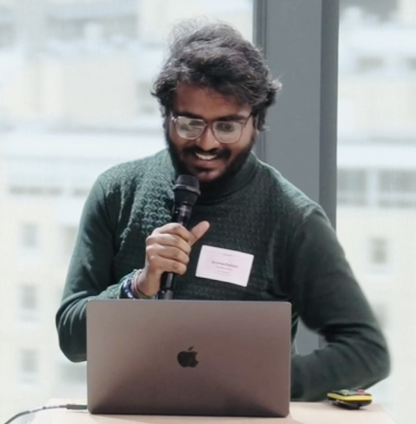

Perfect! I'll go with a **coral-to-purple gradient** (`#FF6B6B` → `#A855F7`) as the primary accent with the **green-on-black hacker terminal**. This creates a beautiful contrast - modern glassmorphism UI meets retro terminal vibes.

Let me create a comprehensive phased implementation plan:

---

# Portfolio Website Revamp - Complete Implementation Plan

## Project Overview

**Design Philosophy:** Apple-inspired minimalism meets hacker aesthetic
**Primary Accent:** Coral-to-Purple gradient (`#FF6B6B` → `#A855F7`)
**Terminal Style:** Classic green phosphor on black (`#00FF00` on `#0a0a0a`)
**Glass Effect:** Frosted glassmorphism with subtle blur and gradient borders

---

## Phase 1: Project Setup & Foundation

### 1.1 File Structure
```
portfolio/
├── index.html
├── css/
│   ├── variables.css      # CSS custom properties, theme tokens
│   ├── base.css           # Reset, typography, global styles
│   ├── components.css     # Reusable components (buttons, cards, glass)
│   ├── layout.css         # Grid, sections, navigation
│   ├── terminal.css       # Terminal-specific styles
│   ├── animations.css     # Keyframes, transitions, scroll animations
│   └── responsive.css     # Media queries, mobile adjustments
├── js/
│   ├── main.js            # Entry point, initialization
│   ├── terminal.js        # Terminal logic, command parsing
│   ├── commands.js        # Command implementations
│   ├── theme.js           # Dark/light mode toggle
│   ├── animations.js      # Scroll triggers, intersection observers
│   ├── navigation.js      # Smooth scroll, active states
│   └── data.js            # Data loading and formatting utilities
├── data/
│   └── portfolio.json     # All portfolio content (provided)
├── assets/
│   ├── images/            # Logos, profile photo
│   └── fonts/             # Local font files if needed
└── README.md
```

### 1.2 CSS Variables Setup (`variables.css`)

```css
:root {
  /* === Color Palette === */
  /* Primary Gradient */
  --gradient-start: #FF6B6B;
  --gradient-end: #A855F7;
  --gradient-primary: linear-gradient(135deg, var(--gradient-start), var(--gradient-end));
  
  /* Dark Mode (Default) */
  --bg-primary: #000000;
  --bg-secondary: #0a0a0a;
  --bg-tertiary: #111111;
  --bg-card: rgba(255, 255, 255, 0.03);
  --bg-glass: rgba(255, 255, 255, 0.05);
  
  --text-primary: #FFFFFF;
  --text-secondary: #A1A1AA;
  --text-tertiary: #71717A;
  --text-muted: #52525B;
  
  --border-subtle: rgba(255, 255, 255, 0.1);
  --border-glass: rgba(255, 255, 255, 0.15);
  
  /* Terminal Colors */
  --terminal-bg: #0a0a0a;
  --terminal-border: #1a1a1a;
  --terminal-green: #00FF00;
  --terminal-green-dim: #00CC00;
  --terminal-green-glow: rgba(0, 255, 0, 0.3);
  --terminal-cursor: #00FF00;
  --terminal-selection: rgba(0, 255, 0, 0.2);
  
  /* Semantic Colors */
  --success: #22C55E;
  --warning: #F59E0B;
  --error: #EF4444;
  --info: #3B82F6;
  
  /* === Typography === */
  --font-display: 'SF Pro Display', -apple-system, BlinkMacSystemFont, 'Segoe UI', Roboto, sans-serif;
  --font-body: 'Inter', -apple-system, BlinkMacSystemFont, 'Segoe UI', Roboto, sans-serif;
  --font-mono: 'JetBrains Mono', 'SF Mono', 'Fira Code', 'Consolas', monospace;
  
  /* Font Sizes - Fluid Typography */
  --text-xs: clamp(0.75rem, 0.7rem + 0.25vw, 0.875rem);
  --text-sm: clamp(0.875rem, 0.8rem + 0.375vw, 1rem);
  --text-base: clamp(1rem, 0.9rem + 0.5vw, 1.125rem);
  --text-lg: clamp(1.125rem, 1rem + 0.625vw, 1.25rem);
  --text-xl: clamp(1.25rem, 1.1rem + 0.75vw, 1.5rem);
  --text-2xl: clamp(1.5rem, 1.25rem + 1.25vw, 2rem);
  --text-3xl: clamp(2rem, 1.5rem + 2.5vw, 3rem);
  --text-4xl: clamp(2.5rem, 1.75rem + 3.75vw, 4rem);
  --text-5xl: clamp(3rem, 2rem + 5vw, 5rem);
  
  /* === Spacing === */
  --space-1: 0.25rem;
  --space-2: 0.5rem;
  --space-3: 0.75rem;
  --space-4: 1rem;
  --space-5: 1.25rem;
  --space-6: 1.5rem;
  --space-8: 2rem;
  --space-10: 2.5rem;
  --space-12: 3rem;
  --space-16: 4rem;
  --space-20: 5rem;
  --space-24: 6rem;
  --space-32: 8rem;
  
  /* === Layout === */
  --container-max: 1200px;
  --container-narrow: 800px;
  --section-padding: clamp(4rem, 8vw, 8rem);
  
  /* === Effects === */
  --blur-sm: 8px;
  --blur-md: 16px;
  --blur-lg: 24px;
  --blur-xl: 40px;
  
  --shadow-sm: 0 1px 2px rgba(0, 0, 0, 0.3);
  --shadow-md: 0 4px 6px rgba(0, 0, 0, 0.4);
  --shadow-lg: 0 10px 15px rgba(0, 0, 0, 0.5);
  --shadow-xl: 0 20px 25px rgba(0, 0, 0, 0.6);
  --shadow-glow: 0 0 30px rgba(168, 85, 247, 0.3);
  
  --radius-sm: 8px;
  --radius-md: 12px;
  --radius-lg: 16px;
  --radius-xl: 24px;
  --radius-full: 9999px;
  
  /* === Transitions === */
  --ease-out: cubic-bezier(0.16, 1, 0.3, 1);
  --ease-in-out: cubic-bezier(0.65, 0, 0.35, 1);
  --ease-spring: cubic-bezier(0.34, 1.56, 0.64, 1);
  
  --duration-fast: 150ms;
  --duration-normal: 300ms;
  --duration-slow: 500ms;
  --duration-slower: 800ms;
  
  /* === Z-Index Scale === */
  --z-base: 0;
  --z-dropdown: 100;
  --z-sticky: 200;
  --z-fixed: 300;
  --z-modal-backdrop: 400;
  --z-modal: 500;
  --z-tooltip: 600;
  --z-toast: 700;
}

/* Light Mode Overrides */
[data-theme="light"] {
  --bg-primary: #FAFAFA;
  --bg-secondary: #F4F4F5;
  --bg-tertiary: #E4E4E7;
  --bg-card: rgba(0, 0, 0, 0.02);
  --bg-glass: rgba(255, 255, 255, 0.7);
  
  --text-primary: #18181B;
  --text-secondary: #52525B;
  --text-tertiary: #71717A;
  --text-muted: #A1A1AA;
  
  --border-subtle: rgba(0, 0, 0, 0.08);
  --border-glass: rgba(0, 0, 0, 0.1);
  
  --shadow-sm: 0 1px 2px rgba(0, 0, 0, 0.05);
  --shadow-md: 0 4px 6px rgba(0, 0, 0, 0.07);
  --shadow-lg: 0 10px 15px rgba(0, 0, 0, 0.1);
  --shadow-xl: 0 20px 25px rgba(0, 0, 0, 0.15);
}
```

### 1.3 Google Fonts Integration

Include in `<head>`:
```html
<link rel="preconnect" href="https://fonts.googleapis.com">
<link rel="preconnect" href="https://fonts.gstatic.com" crossorigin>
<link href="https://fonts.googleapis.com/css2?family=Inter:wght@300;400;500;600;700&family=JetBrains+Mono:wght@400;500;600&display=swap" rel="stylesheet">
```

---

## Phase 2: Base Styles & Typography

### 2.1 CSS Reset & Base (`base.css`)

```css
/* Modern CSS Reset */
*, *::before, *::after {
  box-sizing: border-box;
  margin: 0;
  padding: 0;
}

html {
  scroll-behavior: smooth;
  -webkit-text-size-adjust: 100%;
  text-size-adjust: 100%;
}

body {
  font-family: var(--font-body);
  font-size: var(--text-base);
  line-height: 1.6;
  color: var(--text-primary);
  background-color: var(--bg-primary);
  -webkit-font-smoothing: antialiased;
  -moz-osx-font-smoothing: grayscale;
  overflow-x: hidden;
  min-height: 100vh;
}

/* Smooth theme transitions */
body, body * {
  transition: background-color var(--duration-slow) var(--ease-out),
              border-color var(--duration-slow) var(--ease-out);
}

/* Typography */
h1, h2, h3, h4, h5, h6 {
  font-family: var(--font-display);
  font-weight: 600;
  line-height: 1.2;
  letter-spacing: -0.02em;
}

h1 { font-size: var(--text-5xl); font-weight: 700; }
h2 { font-size: var(--text-4xl); }
h3 { font-size: var(--text-3xl); }
h4 { font-size: var(--text-2xl); }
h5 { font-size: var(--text-xl); }
h6 { font-size: var(--text-lg); }

p {
  color: var(--text-secondary);
  max-width: 65ch; /* Optimal reading width */
}

a {
  color: inherit;
  text-decoration: none;
  transition: color var(--duration-fast) var(--ease-out);
}

img, video, svg {
  display: block;
  max-width: 100%;
  height: auto;
}

button {
  font-family: inherit;
  font-size: inherit;
  cursor: pointer;
  border: none;
  background: none;
}

ul, ol {
  list-style: none;
}

/* Selection */
::selection {
  background: var(--gradient-start);
  color: white;
}

/* Focus styles for accessibility */
:focus-visible {
  outline: 2px solid var(--gradient-end);
  outline-offset: 2px;
}

/* Container */
.container {
  width: 100%;
  max-width: var(--container-max);
  margin: 0 auto;
  padding: 0 var(--space-6);
}

.container--narrow {
  max-width: var(--container-narrow);
}

/* Section */
.section {
  padding: var(--section-padding) 0;
}

/* Gradient text utility */
.gradient-text {
  background: var(--gradient-primary);
  -webkit-background-clip: text;
  background-clip: text;
  -webkit-text-fill-color: transparent;
}

/* Screen reader only */
.sr-only {
  position: absolute;
  width: 1px;
  height: 1px;
  padding: 0;
  margin: -1px;
  overflow: hidden;
  clip: rect(0, 0, 0, 0);
  white-space: nowrap;
  border: 0;
}
```

---

## Phase 3: Glassmorphism Components

### 3.1 Glass Card Component (`components.css`)

```css
/* === Glass Card Base === */
.glass-card {
  position: relative;
  background: var(--bg-glass);
  backdrop-filter: blur(var(--blur-md));
  -webkit-backdrop-filter: blur(var(--blur-md));
  border-radius: var(--radius-lg);
  border: 1px solid var(--border-glass);
  overflow: hidden;
  transition: transform var(--duration-normal) var(--ease-out),
              box-shadow var(--duration-normal) var(--ease-out);
}

/* Gradient border effect using pseudo-element */
.glass-card::before {
  content: '';
  position: absolute;
  inset: 0;
  border-radius: inherit;
  padding: 1px;
  background: linear-gradient(
    135deg,
    rgba(255, 255, 255, 0.1),
    rgba(255, 255, 255, 0.05),
    rgba(255, 255, 255, 0)
  );
  -webkit-mask: linear-gradient(#fff 0 0) content-box, linear-gradient(#fff 0 0);
  mask: linear-gradient(#fff 0 0) content-box, linear-gradient(#fff 0 0);
  -webkit-mask-composite: xor;
  mask-composite: exclude;
  pointer-events: none;
}

.glass-card:hover {
  transform: translateY(-4px);
  box-shadow: var(--shadow-xl), var(--shadow-glow);
}

/* Glass card with gradient accent */
.glass-card--accent {
  border-image: var(--gradient-primary) 1;
}

.glass-card--accent::before {
  background: var(--gradient-primary);
  opacity: 0.2;
}

/* === Buttons === */
.btn {
  display: inline-flex;
  align-items: center;
  justify-content: center;
  gap: var(--space-2);
  padding: var(--space-3) var(--space-6);
  font-family: var(--font-body);
  font-size: var(--text-sm);
  font-weight: 500;
  border-radius: var(--radius-full);
  transition: all var(--duration-normal) var(--ease-out);
  white-space: nowrap;
}

.btn--primary {
  background: var(--gradient-primary);
  color: white;
  box-shadow: 0 4px 15px rgba(168, 85, 247, 0.4);
}

.btn--primary:hover {
  transform: translateY(-2px);
  box-shadow: 0 6px 20px rgba(168, 85, 247, 0.5);
}

.btn--secondary {
  background: var(--bg-glass);
  backdrop-filter: blur(var(--blur-sm));
  color: var(--text-primary);
  border: 1px solid var(--border-glass);
}

.btn--secondary:hover {
  background: rgba(255, 255, 255, 0.1);
  border-color: var(--gradient-start);
}

.btn--ghost {
  background: transparent;
  color: var(--text-secondary);
}

.btn--ghost:hover {
  color: var(--text-primary);
  background: var(--bg-glass);
}

/* === Tags/Chips === */
.tag {
  display: inline-flex;
  align-items: center;
  padding: var(--space-1) var(--space-3);
  font-size: var(--text-xs);
  font-weight: 500;
  background: var(--bg-glass);
  border: 1px solid var(--border-subtle);
  border-radius: var(--radius-full);
  color: var(--text-secondary);
  transition: all var(--duration-fast) var(--ease-out);
}

.tag:hover {
  background: var(--gradient-primary);
  color: white;
  border-color: transparent;
  transform: translateY(-2px);
}

/* === Section Title === */
.section-header {
  margin-bottom: var(--space-12);
}

.section-label {
  display: inline-block;
  font-family: var(--font-mono);
  font-size: var(--text-xs);
  font-weight: 500;
  text-transform: uppercase;
  letter-spacing: 0.1em;
  color: var(--gradient-start);
  margin-bottom: var(--space-4);
}

.section-title {
  position: relative;
  display: inline-block;
}

.section-title::after {
  content: '';
  position: absolute;
  left: 0;
  bottom: -8px;
  width: 60px;
  height: 4px;
  background: var(--gradient-primary);
  border-radius: var(--radius-full);
}
```

---

## Phase 4: Navigation & Header

### 4.1 Header Structure (`layout.css`)

```css
/* === Navigation === */
.header {
  position: fixed;
  top: 0;
  left: 0;
  right: 0;
  z-index: var(--z-fixed);
  padding: var(--space-4) 0;
  transition: all var(--duration-normal) var(--ease-out);
}

.header--scrolled {
  background: var(--bg-glass);
  backdrop-filter: blur(var(--blur-lg));
  -webkit-backdrop-filter: blur(var(--blur-lg));
  border-bottom: 1px solid var(--border-subtle);
}

.header__inner {
  display: flex;
  align-items: center;
  justify-content: space-between;
}

.header__logo {
  font-family: var(--font-display);
  font-size: var(--text-lg);
  font-weight: 700;
  background: var(--gradient-primary);
  -webkit-background-clip: text;
  background-clip: text;
  -webkit-text-fill-color: transparent;
}

.header__nav {
  display: flex;
  align-items: center;
  gap: var(--space-8);
}

.nav__list {
  display: flex;
  align-items: center;
  gap: var(--space-6);
}

.nav__link {
  position: relative;
  font-size: var(--text-sm);
  font-weight: 500;
  color: var(--text-secondary);
  padding: var(--space-2) 0;
  transition: color var(--duration-fast) var(--ease-out);
}

.nav__link::after {
  content: '';
  position: absolute;
  left: 0;
  bottom: 0;
  width: 0;
  height: 2px;
  background: var(--gradient-primary);
  transition: width var(--duration-normal) var(--ease-out);
}

.nav__link:hover,
.nav__link--active {
  color: var(--text-primary);
}

.nav__link:hover::after,
.nav__link--active::after {
  width: 100%;
}

/* Theme Toggle */
.theme-toggle {
  display: flex;
  align-items: center;
  justify-content: center;
  width: 40px;
  height: 40px;
  border-radius: var(--radius-full);
  background: var(--bg-glass);
  border: 1px solid var(--border-subtle);
  color: var(--text-secondary);
  transition: all var(--duration-fast) var(--ease-out);
}

.theme-toggle:hover {
  color: var(--text-primary);
  border-color: var(--gradient-start);
}

.theme-toggle__icon {
  width: 20px;
  height: 20px;
  transition: transform var(--duration-normal) var(--ease-spring);
}

.theme-toggle:hover .theme-toggle__icon {
  transform: rotate(15deg);
}

/* Mobile Menu Button */
.mobile-menu-btn {
  display: none;
  flex-direction: column;
  justify-content: center;
  gap: 5px;
  width: 40px;
  height: 40px;
  padding: 8px;
}

.mobile-menu-btn span {
  display: block;
  width: 100%;
  height: 2px;
  background: var(--text-primary);
  border-radius: var(--radius-full);
  transition: all var(--duration-normal) var(--ease-out);
}

/* Mobile Navigation */
.mobile-nav {
  position: fixed;
  inset: 0;
  z-index: var(--z-modal);
  background: var(--bg-primary);
  padding: var(--space-20) var(--space-6);
  transform: translateX(100%);
  transition: transform var(--duration-slow) var(--ease-out);
  opacity: 0;
  visibility: hidden;
}

.mobile-nav--open {
  transform: translateX(0);
  opacity: 1;
  visibility: visible;
}

.mobile-nav__close {
  position: absolute;
  top: var(--space-6);
  right: var(--space-6);
  width: 48px;
  height: 48px;
  display: flex;
  align-items: center;
  justify-content: center;
  font-size: var(--text-2xl);
  color: var(--text-secondary);
}

.mobile-nav__list {
  display: flex;
  flex-direction: column;
  gap: var(--space-6);
}

.mobile-nav__link {
  font-size: var(--text-2xl);
  font-weight: 600;
  color: var(--text-primary);
}

@media (max-width: 768px) {
  .header__nav .nav__list {
    display: none;
  }
  
  .mobile-menu-btn {
    display: flex;
  }
}
```

---

## Phase 5: Hero Section

### 5.1 Hero Layout

```css
/* === Hero Section === */
.hero {
  min-height: 100vh;
  display: flex;
  align-items: center;
  padding-top: 100px; /* Account for fixed header */
  position: relative;
  overflow: hidden;
}

/* Animated gradient background orbs */
.hero__bg {
  position: absolute;
  inset: 0;
  overflow: hidden;
  pointer-events: none;
}

.hero__orb {
  position: absolute;
  border-radius: 50%;
  filter: blur(80px);
  opacity: 0.5;
  animation: float 20s ease-in-out infinite;
}

.hero__orb--1 {
  width: 600px;
  height: 600px;
  background: var(--gradient-start);
  top: -200px;
  right: -200px;
  animation-delay: 0s;
}

.hero__orb--2 {
  width: 500px;
  height: 500px;
  background: var(--gradient-end);
  bottom: -150px;
  left: -150px;
  animation-delay: -7s;
}

.hero__orb--3 {
  width: 300px;
  height: 300px;
  background: linear-gradient(var(--gradient-start), var(--gradient-end));
  top: 50%;
  left: 50%;
  transform: translate(-50%, -50%);
  animation-delay: -14s;
  opacity: 0.3;
}

@keyframes float {
  0%, 100% { transform: translate(0, 0) scale(1); }
  25% { transform: translate(30px, -30px) scale(1.05); }
  50% { transform: translate(-20px, 20px) scale(0.95); }
  75% { transform: translate(-30px, -20px) scale(1.02); }
}

.hero__content {
  display: grid;
  grid-template-columns: 1fr 1fr;
  gap: var(--space-16);
  align-items: center;
  position: relative;
  z-index: 1;
}

.hero__text {
  max-width: 600px;
}

.hero__greeting {
  font-family: var(--font-mono);
  font-size: var(--text-sm);
  color: var(--gradient-start);
  margin-bottom: var(--space-4);
  opacity: 0;
  animation: fadeInUp 0.6s var(--ease-out) 0.2s forwards;
}

.hero__name {
  font-size: var(--text-5xl);
  font-weight: 700;
  margin-bottom: var(--space-4);
  opacity: 0;
  animation: fadeInUp 0.6s var(--ease-out) 0.4s forwards;
}

.hero__title {
  font-size: var(--text-xl);
  color: var(--text-secondary);
  margin-bottom: var(--space-6);
  line-height: 1.5;
  opacity: 0;
  animation: fadeInUp 0.6s var(--ease-out) 0.6s forwards;
}

.hero__description {
  font-size: var(--text-base);
  color: var(--text-tertiary);
  margin-bottom: var(--space-8);
  max-width: 500px;
  opacity: 0;
  animation: fadeInUp 0.6s var(--ease-out) 0.8s forwards;
}

.hero__actions {
  display: flex;
  flex-wrap: wrap;
  gap: var(--space-4);
  opacity: 0;
  animation: fadeInUp 0.6s var(--ease-out) 1s forwards;
}

/* Hero Image/Visual */
.hero__visual {
  display: flex;
  justify-content: center;
  align-items: center;
  position: relative;
}

.hero__image-wrapper {
  position: relative;
  width: 350px;
  height: 350px;
  opacity: 0;
  animation: fadeInScale 0.8s var(--ease-out) 0.6s forwards;
}

.hero__image {
  width: 100%;
  height: 100%;
  object-fit: cover;
  border-radius: 50%;
  border: 3px solid transparent;
  background: linear-gradient(var(--bg-primary), var(--bg-primary)) padding-box,
              var(--gradient-primary) border-box;
}

/* Rotating gradient ring */
.hero__image-ring {
  position: absolute;
  inset: -15px;
  border-radius: 50%;
  border: 2px dashed var(--gradient-start);
  opacity: 0.3;
  animation: rotate 30s linear infinite;
}

@keyframes rotate {
  from { transform: rotate(0deg); }
  to { transform: rotate(360deg); }
}

@keyframes fadeInUp {
  from {
    opacity: 0;
    transform: translateY(30px);
  }
  to {
    opacity: 1;
    transform: translateY(0);
  }
}

@keyframes fadeInScale {
  from {
    opacity: 0;
    transform: scale(0.8);
  }
  to {
    opacity: 1;
    transform: scale(1);
  }
}

/* Social Links in Hero */
.hero__social {
  display: flex;
  gap: var(--space-3);
  margin-top: var(--space-6);
  opacity: 0;
  animation: fadeInUp 0.6s var(--ease-out) 1.2s forwards;
}

.social-link {
  display: flex;
  align-items: center;
  justify-content: center;
  width: 44px;
  height: 44px;
  border-radius: var(--radius-full);
  background: var(--bg-glass);
  border: 1px solid var(--border-subtle);
  color: var(--text-secondary);
  font-size: var(--text-lg);
  transition: all var(--duration-normal) var(--ease-out);
}

.social-link:hover {
  background: var(--gradient-primary);
  border-color: transparent;
  color: white;
  transform: translateY(-3px);
  box-shadow: 0 10px 20px rgba(168, 85, 247, 0.3);
}

@media (max-width: 968px) {
  .hero__content {
    grid-template-columns: 1fr;
    text-align: center;
  }
  
  .hero__text {
    order: 2;
    margin: 0 auto;
  }
  
  .hero__visual {
    order: 1;
  }
  
  .hero__description {
    margin-left: auto;
    margin-right: auto;
  }
  
  .hero__actions,
  .hero__social {
    justify-content: center;
  }
  
  .hero__image-wrapper {
    width: 280px;
    height: 280px;
  }
}
```

---

## Phase 6: Terminal Component

### 6.1 Terminal Styles (`terminal.css`)

```css
/* === Terminal Container === */
.terminal {
  position: relative;
  width: 100%;
  max-width: 700px;
  margin: 0 auto;
  background: var(--terminal-bg);
  border-radius: var(--radius-lg);
  border: 1px solid var(--terminal-border);
  box-shadow: 
    0 25px 50px -12px rgba(0, 0, 0, 0.8),
    0 0 0 1px rgba(255, 255, 255, 0.05),
    inset 0 1px 0 rgba(255, 255, 255, 0.05);
  overflow: hidden;
  font-family: var(--font-mono);
}

/* Terminal Header (macOS style) */
.terminal__header {
  display: flex;
  align-items: center;
  gap: var(--space-2);
  padding: var(--space-3) var(--space-4);
  background: linear-gradient(180deg, #2d2d2d 0%, #1a1a1a 100%);
  border-bottom: 1px solid var(--terminal-border);
}

.terminal__btn {
  width: 12px;
  height: 12px;
  border-radius: 50%;
  border: none;
  cursor: pointer;
  transition: opacity var(--duration-fast);
}

.terminal__btn:hover {
  opacity: 0.8;
}

.terminal__btn--close { background: #FF5F56; }
.terminal__btn--minimize { background: #FFBD2E; }
.terminal__btn--maximize { background: #27C93F; }

.terminal__title {
  flex: 1;
  text-align: center;
  font-size: var(--text-xs);
  color: var(--text-tertiary);
  user-select: none;
}

/* Terminal Body */
.terminal__body {
  height: 350px;
  padding: var(--space-4);
  overflow-y: auto;
  scrollbar-width: thin;
  scrollbar-color: var(--terminal-green-dim) transparent;
}

.terminal__body::-webkit-scrollbar {
  width: 6px;
}

.terminal__body::-webkit-scrollbar-track {
  background: transparent;
}

.terminal__body::-webkit-scrollbar-thumb {
  background: var(--terminal-green-dim);
  border-radius: 3px;
}

/* Terminal Output */
.terminal__output {
  font-size: var(--text-sm);
  line-height: 1.6;
}

.terminal__line {
  margin-bottom: var(--space-1);
  word-wrap: break-word;
  white-space: pre-wrap;
}

.terminal__line--command {
  color: var(--terminal-green);
}

.terminal__line--output {
  color: #b0b0b0;
}

.terminal__line--error {
  color: var(--error);
}

.terminal__line--success {
  color: var(--success);
}

.terminal__line--info {
  color: var(--info);
}

.terminal__line--highlight {
  color: var(--gradient-start);
}

/* Welcome ASCII Art */
.terminal__ascii {
  color: var(--terminal-green);
  font-size: 10px;
  line-height: 1.2;
  margin-bottom: var(--space-4);
  opacity: 0.8;
}

/* Command prompt styling */
.terminal__prompt {
  color: var(--terminal-green);
}

.terminal__prompt-user {
  color: var(--gradient-start);
}

.terminal__prompt-path {
  color: var(--info);
}

.terminal__prompt-symbol {
  color: var(--terminal-green);
}

/* Input Line */
.terminal__input-line {
  display: flex;
  align-items: center;
  gap: var(--space-2);
  margin-top: var(--space-2);
}

.terminal__input {
  flex: 1;
  background: transparent;
  border: none;
  outline: none;
  color: var(--terminal-green);
  font-family: var(--font-mono);
  font-size: var(--text-sm);
  caret-color: var(--terminal-green);
}

.terminal__input::placeholder {
  color: var(--terminal-green-dim);
  opacity: 0.5;
}

/* Blinking cursor */
.terminal__cursor {
  display: inline-block;
  width: 8px;
  height: 16px;
  background: var(--terminal-green);
  animation: blink 1s step-end infinite;
}

@keyframes blink {
  50% { opacity: 0; }
}

/* Output formatting for data display */
.terminal__table {
  border-collapse: collapse;
  width: 100%;
  margin: var(--space-2) 0;
}

.terminal__table th,
.terminal__table td {
  text-align: left;
  padding: var(--space-1) var(--space-3);
  border-bottom: 1px dashed var(--terminal-border);
}

.terminal__table th {
  color: var(--terminal-green);
  font-weight: 600;
}

.terminal__divider {
  border: none;
  border-top: 1px dashed var(--terminal-green-dim);
  margin: var(--space-3) 0;
  opacity: 0.3;
}

/* Pagination indicator */
.terminal__pagination {
  display: flex;
  justify-content: space-between;
  align-items: center;
  margin-top: var(--space-3);
  padding-top: var(--space-2);
  border-top: 1px dashed var(--terminal-border);
  font-size: var(--text-xs);
  color: var(--text-tertiary);
}

.terminal__pagination-hint {
  color: var(--terminal-green-dim);
}

/* Typing animation for output */
.terminal__typing {
  overflow: hidden;
  animation: typing 0.5s steps(40, end);
}

@keyframes typing {
  from { max-width: 0; }
  to { max-width: 100%; }
}

/* Glow effect on terminal */
.terminal::before {
  content: '';
  position: absolute;
  inset: -1px;
  background: linear-gradient(
    135deg,
    rgba(0, 255, 0, 0.1),
    transparent,
    rgba(0, 255, 0, 0.05)
  );
  border-radius: inherit;
  pointer-events: none;
  opacity: 0;
  transition: opacity var(--duration-normal);
}

.terminal:focus-within::before {
  opacity: 1;
}

/* Hide terminal on mobile */
@media (max-width: 768px) {
  .terminal-section {
    display: none;
  }
}
```

### 6.2 Terminal JavaScript (`terminal.js`)

```javascript
// terminal.js - Core terminal functionality

class Terminal {
  constructor(containerId, data) {
    this.container = document.getElementById(containerId);
    this.data = data;
    this.history = [];
    this.historyIndex = -1;
    this.currentPage = 0;
    this.paginatedData = null;
    this.itemsPerPage = 3;
    
    this.commands = {
      help: this.cmdHelp.bind(this),
      about: this.cmdAbout.bind(this),
      skills: this.cmdSkills.bind(this),
      experience: this.cmdExperience.bind(this),
      education: this.cmdEducation.bind(this),
      projects: this.cmdProjects.bind(this),
      contact: this.cmdContact.bind(this),
      resume: this.cmdResume.bind(this),
      clear: this.cmdClear.bind(this),
      next: this.cmdNext.bind(this),
      prev: this.cmdPrev.bind(this),
      whoami: this.cmdWhoami.bind(this),
      ls: this.cmdLs.bind(this),
      cat: this.cmdCat.bind(this),
      social: this.cmdSocial.bind(this),
    };
    
    this.init();
  }
  
  init() {
    this.outputEl = this.container.querySelector('.terminal__output');
    this.inputEl = this.container.querySelector('.terminal__input');
    
    this.printWelcome();
    this.bindEvents();
    this.inputEl.focus();
  }
  
  bindEvents() {
    this.inputEl.addEventListener('keydown', (e) => this.handleKeydown(e));
    this.container.addEventListener('click', () => this.inputEl.focus());
  }
  
  handleKeydown(e) {
    switch(e.key) {
      case 'Enter':
        this.executeCommand(this.inputEl.value.trim());
        this.inputEl.value = '';
        break;
      case 'ArrowUp':
        e.preventDefault();
        this.navigateHistory(-1);
        break;
      case 'ArrowDown':
        e.preventDefault();
        this.navigateHistory(1);
        break;
      case 'Tab':
        e.preventDefault();
        this.autocomplete();
        break;
      case 'l':
        if (e.ctrlKey) {
          e.preventDefault();
          this.cmdClear();
        }
        break;
    }
  }
  
  navigateHistory(direction) {
    if (this.history.length === 0) return;
    
    this.historyIndex += direction;
    this.historyIndex = Math.max(-1, Math.min(this.history.length - 1, this.historyIndex));
    
    if (this.historyIndex === -1) {
      this.inputEl.value = '';
    } else {
      this.inputEl.value = this.history[this.historyIndex];
    }
  }
  
  autocomplete() {
    const input = this.inputEl.value.toLowerCase();
    const matches = Object.keys(this.commands).filter(cmd => cmd.startsWith(input));
    
    if (matches.length === 1) {
      this.inputEl.value = matches[0];
    } else if (matches.length > 1) {
      this.print(`\nAvailable: ${matches.join(', ')}`, 'info');
      this.printPrompt();
    }
  }
  
  executeCommand(input) {
    if (!input) {
      this.printPrompt();
      return;
    }
    
    // Add to history
    if (this.history[0] !== input) {
      this.history.unshift(input);
    }
    this.historyIndex = -1;
    
    // Print the command
    this.print(`${this.getPrompt()} ${input}`, 'command');
    
    // Parse command and args
    const parts = input.split(' ');
    const cmd = parts[0].toLowerCase().replace('./', '').replace('--', '');
    const args = parts.slice(1);
    
    // Execute
    if (this.commands[cmd]) {
      this.commands[cmd](args);
    } else {
      this.print(`Command not found: ${cmd}. Type 'help' for available commands.`, 'error');
    }
    
    this.scrollToBottom();
  }
  
  // === Output Methods ===
  
  print(text, type = 'output') {
    const line = document.createElement('div');
    line.className = `terminal__line terminal__line--${type}`;
    line.innerHTML = text;
    this.outputEl.appendChild(line);
  }
  
  printPrompt() {
    const prompt = document.createElement('div');
    prompt.className = 'terminal__input-line';
    prompt.innerHTML = `<span class="terminal__prompt">${this.getPrompt()}</span>`;
    this.outputEl.appendChild(prompt);
  }
  
  getPrompt() {
    return `<span class="terminal__prompt-user">guest</span>@<span class="terminal__prompt-path">portfolio</span> <span class="terminal__prompt-symbol">$</span>`;
  }
  
  scrollToBottom() {
    const body = this.container.querySelector('.terminal__body');
    body.scrollTop = body.scrollHeight;
  }
  
  // === Pagination ===
  
  paginate(items, renderer) {
    this.paginatedData = { items, renderer };
    this.currentPage = 0;
    this.renderPage();
  }
  
  renderPage() {
    if (!this.paginatedData) return;
    
    const { items, renderer } = this.paginatedData;
    const start = this.currentPage * this.itemsPerPage;
    const end = Math.min(start + this.itemsPerPage, items.length);
    const pageItems = items.slice(start, end);
    const totalPages = Math.ceil(items.length / this.itemsPerPage);
    
    pageItems.forEach(item => renderer(item));
    
    if (totalPages > 1) {
      this.print(`\n--- Page ${this.currentPage + 1}/${totalPages} ---`, 'info');
      const navHints = [];
      if (this.currentPage < totalPages - 1) navHints.push("'next' for more");
      if (this.currentPage > 0) navHints.push("'prev' to go back");
      this.print(`Type ${navHints.join(' | ')}`, 'info');
    }
  }
  
  // === Commands ===
  
  cmdHelp() {
    this.print(`
╔══════════════════════════════════════════════════════════════╗
║                    AVAILABLE COMMANDS                        ║
╠══════════════════════════════════════════════════════════════╣
║  about       Display personal summary and bio                ║
║  skills      List technical skills by category               ║
║  experience  Show work experience (paginated)                ║
║  education   Display educational background                  ║
║  projects    Browse portfolio projects (paginated)           ║
║  contact     Show contact information                        ║
║  social      Display social media links                      ║
║  resume      Open resume in new tab                          ║
║  whoami      Quick introduction                              ║
║  ls          List available sections                         ║
║  clear       Clear terminal screen                           ║
║  help        Show this help message                          ║
╠══════════════════════════════════════════════════════════════╣
║  NAVIGATION:  next / prev  - Navigate paginated results      ║
║  SHORTCUTS:   Tab - Autocomplete  |  ↑/↓ - Command history   ║
╚══════════════════════════════════════════════════════════════╝
    `, 'output');
  }
  
  cmdAbout() {
    const about = this.data.about;
    this.print(`
┌─────────────────────────────────────────────────────────────┐
│  ABOUT ME                                                    │
└─────────────────────────────────────────────────────────────┘

${this.wrapText(about.summary, 60)}

┌─ CURRENT FOCUS ─────────────────────────────────────────────┐
${this.wrapText(about.current_work, 60)}

┌─ HIGHLIGHTS ────────────────────────────────────────────────┐
${this.wrapText(about.beyond_classroom, 60)}
    `, 'output');
  }
  
  cmdSkills(args) {
    const skills = this.data.skills;
    const category = args[0]?.toLowerCase();
    
    const categories = {
      languages: skills.languages,
      ai: skills.ai_ml,
      frameworks: skills.frameworks_libraries,
      cloud: skills.cloud_backend_data
    };
    
    if (category && categories[category]) {
      this.print(`\n[${category.toUpperCase()}]`, 'highlight');
      this.print(categories[category].join(' • '), 'output');
    } else {
      this.print(`
┌─────────────────────────────────────────────────────────────┐
│  TECHNICAL SKILLS                                            │
└─────────────────────────────────────────────────────────────┘

[LANGUAGES]
${skills.languages.join(' • ')}

[AI & MACHINE LEARNING]
${skills.ai_ml.slice(0, 6).join(' • ')}
${skills.ai_ml.slice(6).join(' • ')}

[FRAMEWORKS & LIBRARIES]
${skills.frameworks_libraries.slice(0, 8).join(' • ')}
... and ${skills.frameworks_libraries.length - 8} more

[CLOUD & INFRASTRUCTURE]
${skills.cloud_backend_data.slice(0, 6).join(' • ')}
... and ${skills.cloud_backend_data.length - 6} more

─────────────────────────────────────────────────────────────
Tip: Use 'skills [category]' for full list
Categories: languages, ai, frameworks, cloud
      `, 'output');
    }
  }
  
  cmdExperience() {
    this.paginate(this.data.experience, (exp) => {
      this.print(`
┌─────────────────────────────────────────────────────────────┐
│  ${exp.position.toUpperCase().padEnd(57)} │
│  @ ${exp.company.padEnd(55)} │
│  ${exp.duration.padEnd(57)} │
│  ${exp.location.padEnd(57)} │
└─────────────────────────────────────────────────────────────┘

${exp.responsibilities.map(r => `  • ${this.wrapText(r, 55)}`).join('\n\n')}

  [Tech] ${exp.technologies.slice(0, 5).join(', ')}${exp.technologies.length > 5 ? '...' : ''}
      `, 'output');
    });
  }
  
  cmdEducation() {
    this.data.education.forEach(edu => {
      this.print(`
┌─────────────────────────────────────────────────────────────┐
│  ${edu.degree.toUpperCase().substring(0, 57).padEnd(57)} │
│  ${edu.institution.substring(0, 57).padEnd(57)} │
│  ${edu.duration.padEnd(57)} │
│  GPA: ${edu.gpa.padEnd(51)} │
└─────────────────────────────────────────────────────────────┘

  Coursework: ${edu.coursework.slice(0, 4).join(', ')}
              ${edu.coursework.slice(4, 8).join(', ')}
      `, 'output');
    });
  }
  
  cmdProjects() {
    this.paginate(this.data.projects, (proj) => {
      const badge = proj.achievement ? `[🏆 ${proj.achievement}]` : 
                    proj.publication ? `[📚 ${proj.publication}]` : '';
      
      this.print(`
┌─────────────────────────────────────────────────────────────┐
│  ${proj.name.substring(0, 57).toUpperCase().padEnd(57)} │
${badge ? `│  ${badge.padEnd(57)} │\n` : ''}└─────────────────────────────────────────────────────────────┘

${proj.description.map(d => `  ${this.wrapText(d, 55)}`).join('\n\n')}

  [Stack] ${proj.technologies.join(', ')}
      `, 'output');
    });
  }
  
  cmdContact() {
    const contact = this.data.personal_info.contact;
    this.print(`
┌─────────────────────────────────────────────────────────────┐
│  CONTACT INFORMATION                                         │
└─────────────────────────────────────────────────────────────┘

  📧 Email    : ${contact.email}
  📱 Phone    : ${this.data.personal_info.contact.phone || 'Available on request'}
  💼 LinkedIn : ${contact.linkedin}
  🐙 GitHub   : ${contact.github_alt}

─────────────────────────────────────────────────────────────
Type 'social' to open links or 'resume' to view CV
    `, 'output');
  }
  
  cmdSocial() {
    const contact = this.data.personal_info.contact;
    this.print(`
Opening social profiles in new tabs...
  • LinkedIn: ${contact.linkedin}
  • GitHub: ${contact.github_alt}
    `, 'success');
    
    window.open(contact.linkedin, '_blank');
    window.open(contact.github_alt, '_blank');
  }
  
  cmdResume() {
    const link = this.data.personal_info.resume_link;
    this.print(`Opening resume: ${link}`, 'success');
    window.open(link, '_blank');
  }
  
  cmdWhoami() {
    this.print(`
${this.data.personal_info.name}
${this.data.personal_info.title}

"${this.data.about.summary.substring(0, 100)}..."
    `, 'highlight');
  }
  
  cmdLs() {
    this.print(`
drwxr-xr-x  about/
drwxr-xr-x  education/
drwxr-xr-x  experience/
drwxr-xr-x  projects/
drwxr-xr-x  skills/
-rw-r--r--  contact.txt
-rw-r--r--  resume.pdf
    `, 'output');
  }
  
  cmdCat(args) {
    const file = args[0];
    if (file === 'contact.txt') {
      this.cmdContact();
    } else if (file === 'resume.pdf') {
      this.cmdResume();
    } else {
      this.print(`cat: ${file || '[no file specified]'}: No such file`, 'error');
    }
  }
  
  cmdNext() {
    if (!this.paginatedData) {
      this.print('No paginated content. Try "experience" or "projects" first.', 'error');
      return;
    }
    
    const totalPages = Math.ceil(this.paginatedData.items.length / this.itemsPerPage);
    if (this.currentPage < totalPages - 1) {
      this.currentPage++;
      this.renderPage();
    } else {
      this.print('Already at last page.', 'info');
    }
  }
  
  cmdPrev() {
    if (!this.paginatedData) {
      this.print('No paginated content. Try "experience" or "projects" first.', 'error');
      return;
    }
    
    if (this.currentPage > 0) {
      this.currentPage--;
      this.renderPage();
    } else {
      this.print('Already at first page.', 'info');
    }
  }
  
  cmdClear() {
    this.outputEl.innerHTML = '';
    this.printWelcome();
  }
  
  // === Utility ===
  
  wrapText(text, maxWidth) {
    const words = text.split(' ');
    const lines = [];
    let currentLine = '';
    
    words.forEach(word => {
      if ((currentLine + word).length > maxWidth) {
        lines.push(currentLine.trim());
        currentLine = word + ' ';
      } else {
        currentLine += word + ' ';
      }
    });
    
    if (currentLine.trim()) {
      lines.push(currentLine.trim());
    }
    
    return lines.join('\n  ');
  }
  
  printWelcome() {
    this.print(`
<span class="terminal__ascii">
    _                        _           _                 
   / \\   _ __ _   _ _ __    / \\   _   _ | |_  ___  _ __  
  / _ \\ | '__| | | | '_ \\  / _ \\ | | | || __|/ _ \\| '_ \\ 
 / ___ \\| |  | |_| | | | |/ ___ \\| |_| || |_| (_) | | | |
/_/   \\_\\_|   \\__,_|_| |_/_/   \\_\\\\__,_| \\__|\\___/|_| |_|
</span>
Welcome to my interactive portfolio terminal!
Type <span class="terminal__line--highlight">'help'</span> to see available commands.

<span class="terminal__line--info">Hint: Try 'about', 'skills', or 'projects' to get started.</span>
    `, 'output');
  }
}

// Export for module usage
export default Terminal;
```

---

## Phase 7: Content Sections

### 7.1 Experience Section Layout

```css
/* === Timeline/Experience Section === */
.experience-grid {
  display: grid;
  gap: var(--space-8);
}

.experience-card {
  display: grid;
  grid-template-columns: auto 1fr;
  gap: var(--space-6);
  padding: var(--space-8);
}

.experience-card__logo {
  width: 60px;
  height: 60px;
  border-radius: var(--radius-md);
  object-fit: contain;
  background: white;
  padding: var(--space-2);
}

.experience-card__header {
  margin-bottom: var(--space-4);
}

.experience-card__company {
  font-size: var(--text-lg);
  font-weight: 600;
  color: var(--text-primary);
  margin-bottom: var(--space-1);
}

.experience-card__position {
  font-size: var(--text-base);
  background: var(--gradient-primary);
  -webkit-background-clip: text;
  background-clip: text;
  -webkit-text-fill-color: transparent;
  font-weight: 500;
}

.experience-card__meta {
  display: flex;
  flex-wrap: wrap;
  gap: var(--space-4);
  font-size: var(--text-sm);
  color: var(--text-tertiary);
  margin-top: var(--space-2);
}

.experience-card__responsibilities {
  margin: var(--space-4) 0;
}

.experience-card__responsibilities li {
  position: relative;
  padding-left: var(--space-5);
  margin-bottom: var(--space-3);
  color: var(--text-secondary);
  font-size: var(--text-sm);
  line-height: 1.6;
}

.experience-card__responsibilities li::before {
  content: '▹';
  position: absolute;
  left: 0;
  color: var(--gradient-start);
}

.experience-card__tech {
  display: flex;
  flex-wrap: wrap;
  gap: var(--space-2);
  margin-top: var(--space-4);
}

@media (max-width: 640px) {
  .experience-card {
    grid-template-columns: 1fr;
  }
  
  .experience-card__logo {
    width: 48px;
    height: 48px;
  }
}
```

### 7.2 Projects Section

```css
/* === Projects Grid === */
.projects-grid {
  display: grid;
  grid-template-columns: repeat(auto-fit, minmax(350px, 1fr));
  gap: var(--space-8);
}

.project-card {
  position: relative;
  padding: var(--space-8);
  min-height: 400px;
  display: flex;
  flex-direction: column;
}

.project-card__badge {
  display: inline-flex;
  align-items: center;
  gap: var(--space-2);
  padding: var(--space-1) var(--space-3);
  background: var(--gradient-primary);
  color: white;
  font-size: var(--text-xs);
  font-weight: 600;
  border-radius: var(--radius-full);
  margin-bottom: var(--space-4);
  width: fit-content;
}

.project-card__title {
  font-size: var(--text-xl);
  font-weight: 600;
  color: var(--text-primary);
  margin-bottom: var(--space-4);
  line-height: 1.3;
}

.project-card__description {
  font-size: var(--text-sm);
  color: var(--text-secondary);
  line-height: 1.6;
  margin-bottom: var(--space-6);
  flex-grow: 1;
}

.project-card__tech {
  display: flex;
  flex-wrap: wrap;
  gap: var(--space-2);
  margin-bottom: var(--space-6);
}

.project-card__links {
  display: flex;
  gap: var(--space-3);
  margin-top: auto;
}

.project-card__link {
  display: inline-flex;
  align-items: center;
  gap: var(--space-2);
  padding: var(--space-2) var(--space-4);
  font-size: var(--text-sm);
  font-weight: 500;
  border-radius: var(--radius-full);
  transition: all var(--duration-normal) var(--ease-out);
}

.project-card__link--primary {
  background: var(--bg-glass);
  border: 1px solid var(--border-glass);
  color: var(--text-primary);
}

.project-card__link--primary:hover {
  background: var(--gradient-primary);
  border-color: transparent;
  color: white;
}

.project-card__link--secondary {
  color: var(--text-secondary);
}

.project-card__link--secondary:hover {
  color: var(--gradient-start);
}
```

### 7.3 Skills Section

```css
/* === Skills Section === */
.skills-section {
  padding: var(--section-padding) 0;
}

.skills-category {
  margin-bottom: var(--space-12);
}

.skills-category__title {
  font-size: var(--text-lg);
  font-weight: 600;
  color: var(--text-primary);
  margin-bottom: var(--space-6);
  display: flex;
  align-items: center;
  gap: var(--space-3);
}

.skills-category__title::before {
  content: '';
  display: block;
  width: 4px;
  height: 24px;
  background: var(--gradient-primary);
  border-radius: var(--radius-full);
}

.skills-list {
  display: flex;
  flex-wrap: wrap;
  gap: var(--space-3);
}

/* Skill item with hover effect */
.skill-item {
  padding: var(--space-2) var(--space-4);
  background: var(--bg-glass);
  border: 1px solid var(--border-subtle);
  border-radius: var(--radius-full);
  font-size: var(--text-sm);
  color: var(--text-secondary);
  transition: all var(--duration-normal) var(--ease-out);
  cursor: default;
}

.skill-item:hover {
  background: var(--gradient-primary);
  border-color: transparent;
  color: white;
  transform: translateY(-3px);
  box-shadow: 0 10px 20px rgba(168, 85, 247, 0.2);
}
```

---

## Phase 8: Animations & Scroll Effects

### 8.1 Scroll-Triggered Animations (`animations.css`)

```css
/* === Scroll Reveal Animations === */

/* Base state - elements start invisible */
[data-animate] {
  opacity: 0;
  transition: 
    opacity var(--duration-slower) var(--ease-out),
    transform var(--duration-slower) var(--ease-out);
}

/* Fade up animation */
[data-animate="fade-up"] {
  transform: translateY(40px);
}

[data-animate="fade-up"].is-visible {
  opacity: 1;
  transform: translateY(0);
}

/* Fade in animation */
[data-animate="fade-in"] {
  opacity: 0;
}

[data-animate="fade-in"].is-visible {
  opacity: 1;
}

/* Scale up animation */
[data-animate="scale-up"] {
  transform: scale(0.9);
}

[data-animate="scale-up"].is-visible {
  opacity: 1;
  transform: scale(1);
}

/* Slide in from left */
[data-animate="slide-left"] {
  transform: translateX(-40px);
}

[data-animate="slide-left"].is-visible {
  opacity: 1;
  transform: translateX(0);
}

/* Slide in from right */
[data-animate="slide-right"] {
  transform: translateX(40px);
}

[data-animate="slide-right"].is-visible {
  opacity: 1;
  transform: translateX(0);
}

/* Staggered children animation */
[data-animate-stagger] > * {
  opacity: 0;
  transform: translateY(20px);
  transition: 
    opacity var(--duration-normal) var(--ease-out),
    transform var(--duration-normal) var(--ease-out);
}

[data-animate-stagger].is-visible > *:nth-child(1) { transition-delay: 0ms; }
[data-animate-stagger].is-visible > *:nth-child(2) { transition-delay: 100ms; }
[data-animate-stagger].is-visible > *:nth-child(3) { transition-delay: 200ms; }
[data-animate-stagger].is-visible > *:nth-child(4) { transition-delay: 300ms; }
[data-animate-stagger].is-visible > *:nth-child(5) { transition-delay: 400ms; }
[data-animate-stagger].is-visible > *:nth-child(6) { transition-delay: 500ms; }

[data-animate-stagger].is-visible > * {
  opacity: 1;
  transform: translateY(0);
}
/* === Hover Animations === */

/* Lift on hover */
.hover-lift {
  transition: transform var(--duration-normal) var(--ease-out);
}

.hover-lift:hover {
  transform: translateY(-5px);
}

/* Glow on hover */
.hover-glow {
  transition: box-shadow var(--duration-normal) var(--ease-out);
}

.hover-glow:hover {
  box-shadow: var(--shadow-glow);
}

/* Scale on hover */
.hover-scale {
  transition: transform var(--duration-normal) var(--ease-out);
}

.hover-scale:hover {
  transform: scale(1.02);
}

/* === Loading States === */

@keyframes shimmer {
  0% { background-position: -200% 0; }
  100% { background-position: 200% 0; }
}

.skeleton {
  background: linear-gradient(
    90deg,
    var(--bg-card) 25%,
    var(--bg-glass) 50%,
    var(--bg-card) 75%
  );
  background-size: 200% 100%;
  animation: shimmer 1.5s infinite;
  border-radius: var(--radius-sm);
}

/* === Page Transitions === */

.page-transition-enter {
  opacity: 0;
  transform: translateY(20px);
}

.page-transition-enter-active {
  opacity: 1;
  transform: translateY(0);
  transition: all var(--duration-slow) var(--ease-out);
}

.page-transition-exit {
  opacity: 1;
}

.page-transition-exit-active {
  opacity: 0;
  transition: opacity var(--duration-normal) var(--ease-out);
}
```

### 8.2 Animation JavaScript (`animations.js`)

```javascript
// animations.js - Scroll-triggered animations

class ScrollAnimations {
  constructor() {
    this.observerOptions = {
      root: null,
      rootMargin: '0px 0px -10% 0px',
      threshold: 0.1
    };
    
    this.init();
  }
  
  init() {
    this.setupIntersectionObserver();
    this.setupSmoothScroll();
    this.setupParallax();
  }
  
  setupIntersectionObserver() {
    const observer = new IntersectionObserver((entries) => {
      entries.forEach(entry => {
        if (entry.isIntersecting) {
          entry.target.classList.add('is-visible');
          
          // Unobserve after animation (performance)
          if (!entry.target.dataset.animateRepeat) {
            observer.unobserve(entry.target);
          }
        } else if (entry.target.dataset.animateRepeat) {
          entry.target.classList.remove('is-visible');
        }
      });
    }, this.observerOptions);
    
    // Observe all animated elements
    document.querySelectorAll('[data-animate], [data-animate-stagger]').forEach(el => {
      observer.observe(el);
    });
  }
  
  setupSmoothScroll() {
    document.querySelectorAll('a[href^="#"]').forEach(anchor => {
      anchor.addEventListener('click', (e) => {
        e.preventDefault();
        const target = document.querySelector(anchor.getAttribute('href'));
        
        if (target) {
          const headerOffset = 80;
          const elementPosition = target.getBoundingClientRect().top;
          const offsetPosition = elementPosition + window.pageYOffset - headerOffset;
          
          window.scrollTo({
            top: offsetPosition,
            behavior: 'smooth'
          });
        }
      });
    });
  }
  
  setupParallax() {
    const parallaxElements = document.querySelectorAll('[data-parallax]');
    
    if (parallaxElements.length === 0) return;
    
    let ticking = false;
    
    window.addEventListener('scroll', () => {
      if (!ticking) {
        window.requestAnimationFrame(() => {
          const scrolled = window.pageYOffset;
          
          parallaxElements.forEach(el => {
            const speed = parseFloat(el.dataset.parallax) || 0.5;
            const yPos = -(scrolled * speed);
            el.style.transform = `translate3d(0, ${yPos}px, 0)`;
          });
          
          ticking = false;
        });
        
        ticking = true;
      }
    });
  }
}

// Initialize
document.addEventListener('DOMContentLoaded', () => {
  new ScrollAnimations();
});

export default ScrollAnimations;
```

---

## Phase 9: Theme Toggle & Navigation

### 9.1 Theme Toggle (`theme.js`)

```javascript
// theme.js - Dark/Light mode toggle

class ThemeManager {
  constructor() {
    this.theme = this.getStoredTheme() || this.getSystemTheme();
    this.toggleBtn = document.querySelector('.theme-toggle');
    this.init();
  }
  
  init() {
    this.applyTheme(this.theme);
    this.bindEvents();
  }
  
  getStoredTheme() {
    return localStorage.getItem('theme');
  }
  
  getSystemTheme() {
    return window.matchMedia('(prefers-color-scheme: light)').matches ? 'light' : 'dark';
  }
  
  applyTheme(theme) {
    document.documentElement.setAttribute('data-theme', theme);
    this.updateIcon(theme);
    localStorage.setItem('theme', theme);
    this.theme = theme;
  }
  
  updateIcon(theme) {
    if (!this.toggleBtn) return;
    
    const icon = this.toggleBtn.querySelector('.theme-toggle__icon');
    if (icon) {
      icon.innerHTML = theme === 'dark' 
        ? `<svg xmlns="http://www.w3.org/2000/svg" fill="none" viewBox="0 0 24 24" stroke="currentColor">
             <path stroke-linecap="round" stroke-linejoin="round" stroke-width="2" d="M12 3v1m0 16v1m9-9h-1M4 12H3m15.364 6.364l-.707-.707M6.343 6.343l-.707-.707m12.728 0l-.707.707M6.343 17.657l-.707.707M16 12a4 4 0 11-8 0 4 4 0 018 0z" />
           </svg>`
        : `<svg xmlns="http://www.w3.org/2000/svg" fill="none" viewBox="0 0 24 24" stroke="currentColor">
             <path stroke-linecap="round" stroke-linejoin="round" stroke-width="2" d="M20.354 15.354A9 9 0 018.646 3.646 9.003 9.003 0 0012 21a9.003 9.003 0 008.354-5.646z" />
           </svg>`;
    }
  }
  
  toggle() {
    const newTheme = this.theme === 'dark' ? 'light' : 'dark';
    this.applyTheme(newTheme);
  }
  
  bindEvents() {
    if (this.toggleBtn) {
      this.toggleBtn.addEventListener('click', () => this.toggle());
    }
    
    // Listen for system theme changes
    window.matchMedia('(prefers-color-scheme: dark)').addEventListener('change', (e) => {
      if (!localStorage.getItem('theme')) {
        this.applyTheme(e.matches ? 'dark' : 'light');
      }
    });
  }
}

export default ThemeManager;
```

### 9.2 Navigation (`navigation.js`)

```javascript
// navigation.js - Header scroll behavior & active states

class Navigation {
  constructor() {
    this.header = document.querySelector('.header');
    this.mobileNav = document.querySelector('.mobile-nav');
    this.mobileMenuBtn = document.querySelector('.mobile-menu-btn');
    this.mobileCloseBtn = document.querySelector('.mobile-nav__close');
    this.navLinks = document.querySelectorAll('.nav__link, .mobile-nav__link');
    this.sections = document.querySelectorAll('section[id]');
    
    this.init();
  }
  
  init() {
    this.bindScrollEvents();
    this.bindMobileMenuEvents();
    this.setupActiveStates();
  }
  
  bindScrollEvents() {
    let lastScroll = 0;
    let ticking = false;
    
    window.addEventListener('scroll', () => {
      if (!ticking) {
        window.requestAnimationFrame(() => {
          const currentScroll = window.pageYOffset;
          
          // Add scrolled class for background
          if (currentScroll > 50) {
            this.header.classList.add('header--scrolled');
          } else {
            this.header.classList.remove('header--scrolled');
          }
          
          // Hide/show on scroll direction (optional)
          if (currentScroll > lastScroll && currentScroll > 200) {
            this.header.style.transform = 'translateY(-100%)';
          } else {
            this.header.style.transform = 'translateY(0)';
          }
          
          lastScroll = currentScroll;
          ticking = false;
        });
        
        ticking = true;
      }
    });
  }
  
  bindMobileMenuEvents() {
    if (this.mobileMenuBtn) {
      this.mobileMenuBtn.addEventListener('click', () => this.openMobileNav());
    }
    
    if (this.mobileCloseBtn) {
      this.mobileCloseBtn.addEventListener('click', () => this.closeMobileNav());
    }
    
    // Close on link click
    document.querySelectorAll('.mobile-nav__link').forEach(link => {
      link.addEventListener('click', () => this.closeMobileNav());
    });
    
    // Close on escape key
    document.addEventListener('keydown', (e) => {
      if (e.key === 'Escape' && this.mobileNav.classList.contains('mobile-nav--open')) {
        this.closeMobileNav();
      }
    });
  }
  
  openMobileNav() {
    this.mobileNav.classList.add('mobile-nav--open');
    document.body.style.overflow = 'hidden';
  }
  
  closeMobileNav() {
    this.mobileNav.classList.remove('mobile-nav--open');
    document.body.style.overflow = '';
  }
  
  setupActiveStates() {
    const observerOptions = {
      root: null,
      rootMargin: '-20% 0px -80% 0px',
      threshold: 0
    };
    
    const observer = new IntersectionObserver((entries) => {
      entries.forEach(entry => {
        if (entry.isIntersecting) {
          const id = entry.target.getAttribute('id');
          this.setActiveLink(id);
        }
      });
    }, observerOptions);
    
    this.sections.forEach(section => observer.observe(section));
  }
  
  setActiveLink(id) {
    this.navLinks.forEach(link => {
      link.classList.remove('nav__link--active');
      if (link.getAttribute('href') === `#${id}`) {
        link.classList.add('nav__link--active');
      }
    });
  }
}

export default Navigation;
```

---

## Phase 10: Main Entry Point & Data Loading

### 10.1 Main JavaScript (`main.js`)

```javascript
// main.js - Application entry point

import ThemeManager from './theme.js';
import Navigation from './navigation.js';
import ScrollAnimations from './animations.js';
import Terminal from './terminal.js';

class PortfolioApp {
  constructor() {
    this.data = null;
    this.init();
  }
  
  async init() {
    // Load data first
    await this.loadData();
    
    // Initialize modules
    new ThemeManager();
    new Navigation();
    new ScrollAnimations();
    
    // Initialize terminal if element exists
    const terminalEl = document.getElementById('terminal');
    if (terminalEl && this.data) {
      new Terminal('terminal', this.data);
    }
    
    // Render dynamic content
    this.renderContent();
    
    // Remove loading state
    document.body.classList.add('is-loaded');
  }
  
  async loadData() {
    try {
      const response = await fetch('./data/portfolio.json');
      this.data = await response.json();
    } catch (error) {
      console.error('Failed to load portfolio data:', error);
    }
  }
  
  renderContent() {
    if (!this.data) return;
    
    this.renderHero();
    this.renderExperience();
    this.renderProjects();
    this.renderSkills();
    this.renderEducation();
  }
  
  renderHero() {
    const { personal_info, about } = this.data;
    
    // Update hero content
    const nameEl = document.querySelector('.hero__name');
    const titleEl = document.querySelector('.hero__title');
    const descEl = document.querySelector('.hero__description');
    const imageEl = document.querySelector('.hero__image');
    
    if (nameEl) nameEl.textContent = personal_info.name;
    if (titleEl) titleEl.textContent = personal_info.title;
    if (descEl) descEl.textContent = about.summary;
    if (imageEl) imageEl.src = personal_info.profile_image;
  }
  
  renderExperience() {
    const container = document.querySelector('.experience-grid');
    if (!container) return;
    
    container.innerHTML = this.data.experience.map(exp => `
      <article class="glass-card experience-card" data-animate="fade-up">
        
        <div class="experience-card__content">
          <header class="experience-card__header">
            <h3 class="experience-card__company">${exp.company}</h3>
            <p class="experience-card__position">${exp.position}</p>
            <div class="experience-card__meta">
              <span>${exp.duration}</span>
              <span>${exp.location}</span>
            </div>
          </header>
          <ul class="experience-card__responsibilities">
            ${exp.responsibilities.map(r => `<li>${r}</li>`).join('')}
          </ul>
          <div class="experience-card__tech">
            ${exp.technologies.slice(0, 6).map(t => `<span class="tag">${t}</span>`).join('')}
          </div>
        </div>
      </article>
    `).join('');
  }
  
  renderProjects() {
    const container = document.querySelector('.projects-grid');
    if (!container) return;
    
    container.innerHTML = this.data.projects.map(proj => `
      <article class="glass-card project-card" data-animate="fade-up">
        ${proj.achievement || proj.publication ? `
          <span class="project-card__badge">
            ${proj.achievement ? '🏆 ' + proj.achievement : '📚 ' + proj.publication}
          </span>
        ` : ''}
        <h3 class="project-card__title">${proj.name}</h3>
        <p class="project-card__description">${proj.description[0]}</p>
        <div class="project-card__tech">
          ${proj.technologies.map(t => `<span class="tag">${t}</span>`).join('')}
        </div>
      </article>
    `).join('');
  }
  
  renderSkills() {
    const container = document.querySelector('.skills-section .container');
    if (!container) return;
    
    const { skills } = this.data;
    const categories = [
      { title: 'Languages', items: skills.languages },
      { title: 'AI & Machine Learning', items: skills.ai_ml },
      { title: 'Frameworks & Libraries', items: skills.frameworks_libraries },
      { title: 'Cloud & Infrastructure', items: skills.cloud_backend_data }
    ];
    
    const skillsHTML = categories.map(cat => `
      <div class="skills-category" data-animate="fade-up">
        <h3 class="skills-category__title">${cat.title}</h3>
        <div class="skills-list">
          ${cat.items.map(s => `<span class="skill-item">${s}</span>`).join('')}
        </div>
      </div>
    `).join('');
    
    container.querySelector('.skills-content')?.remove();
    container.insertAdjacentHTML('beforeend', `<div class="skills-content">${skillsHTML}</div>`);
  }
  
  renderEducation() {
    const container = document.querySelector('.education-grid');
    if (!container) return;
    
    container.innerHTML = this.data.education.map(edu => `
      <article class="glass-card education-card" data-animate="fade-up">
        
        <div class="education-card__content">
          <h3 class="education-card__institution">${edu.institution}</h3>
          <p class="education-card__degree">${edu.degree}</p>
          <div class="education-card__meta">
            <span>${edu.duration}</span>
            <span>GPA: ${edu.gpa}</span>
          </div>
          <div class="education-card__coursework">
            ${edu.coursework.slice(0, 6).map(c => `<span class="tag">${c}</span>`).join('')}
          </div>
        </div>
      </article>
    `).join('');
  }
}

// Initialize app when DOM is ready
document.addEventListener('DOMContentLoaded', () => {
  new PortfolioApp();
});
```

---

## Phase 11: HTML Structure

### 11.1 Complete HTML (`index.html`)

```html
<!DOCTYPE html>
<html lang="en" data-theme="dark">
<head>
  <meta charset="UTF-8">
  <meta name="viewport" content="width=device-width, initial-scale=1.0">
  <meta name="description" content="Arunachalam Manikandan - AI Engineer, CS Grad Student specializing in LLMs, RAG systems, and full-stack development">
  <meta name="keywords" content="AI Engineer, Machine Learning, LLM, RAG, Full Stack Developer">
  <meta name="author" content="Arunachalam Manikandan">
  
  <!-- Open Graph -->
  <meta property="og:title" content="Arunachalam Manikandan | AI Engineer">
  <meta property="og:description" content="AI Engineer specializing in LLMs, RAG pipelines, and agentic frameworks">
  <meta property="og:type" content="website">
  
  <title>Arunachalam Manikandan | AI Engineer</title>
  
  <!-- Fonts -->
  <link rel="preconnect" href="https://fonts.googleapis.com">
  <link rel="preconnect" href="https://fonts.gstatic.com" crossorigin>
  <link href="https://fonts.googleapis.com/css2?family=Inter:wght@300;400;500;600;700&family=JetBrains+Mono:wght@400;500;600&display=swap" rel="stylesheet">
  
  <!-- Icons -->
  <link rel="stylesheet" href="https://cdnjs.cloudflare.com/ajax/libs/font-awesome/6.4.0/css/all.min.css">
  
  <!-- Styles -->
  <link rel="stylesheet" href="css/variables.css">
  <link rel="stylesheet" href="css/base.css">
  <link rel="stylesheet" href="css/components.css">
  <link rel="stylesheet" href="css/layout.css">
  <link rel="stylesheet" href="css/terminal.css">
  <link rel="stylesheet" href="css/animations.css">
  <link rel="stylesheet" href="css/responsive.css">
</head>
<body>
  <!-- Header -->
  <header class="header">
    <div class="container">
      <div class="header__inner">
        <a href="#" class="header__logo">AM</a>
        
        <nav class="header__nav">
          <ul class="nav__list">
            <li><a href="#home" class="nav__link nav__link--active">Home</a></li>
            <li><a href="#about" class="nav__link">About</a></li>
            <li><a href="#experience" class="nav__link">Experience</a></li>
            <li><a href="#projects" class="nav__link">Projects</a></li>
            <li><a href="#skills" class="nav__link">Skills</a></li>
            <li><a href="#education" class="nav__link">Education</a></li>
            <li><a href="#contact" class="nav__link">Contact</a></li>
          </ul>
          
          <button class="theme-toggle" aria-label="Toggle theme">
            <svg class="theme-toggle__icon" xmlns="http://www.w3.org/2000/svg" fill="none" viewBox="0 0 24 24" stroke="currentColor">
              <path stroke-linecap="round" stroke-linejoin="round" stroke-width="2" d="M12 3v1m0 16v1m9-9h-1M4 12H3m15.364 6.364l-.707-.707M6.343 6.343l-.707-.707m12.728 0l-.707.707M6.343 17.657l-.707.707M16 12a4 4 0 11-8 0 4 4 0 018 0z" />
            </svg>
          </button>
        </nav>
        
        <button class="mobile-menu-btn" aria-label="Open menu">
          <span></span>
          <span></span>
          <span></span>
        </button>
      </div>
    </div>
  </header>
  
  <!-- Mobile Navigation -->
  <nav class="mobile-nav" id="mobile-nav">
    <button class="mobile-nav__close" aria-label="Close menu">
      <i class="fas fa-times"></i>
    </button>
    <ul class="mobile-nav__list">
      <li><a href="#home" class="mobile-nav__link">Home</a></li>
      <li><a href="#about" class="mobile-nav__link">About</a></li>
      <li><a href="#experience" class="mobile-nav__link">Experience</a></li>
      <li><a href="#projects" class="mobile-nav__link">Projects</a></li>
      <li><a href="#skills" class="mobile-nav__link">Skills</a></li>
      <li><a href="#education" class="mobile-nav__link">Education</a></li>
      <li><a href="#contact" class="mobile-nav__link">Contact</a></li>
    </ul>
  </nav>
  
  <main>
    <!-- Hero Section -->
    <section id="home" class="hero">
      <div class="hero__bg">
        <div class="hero__orb hero__orb--1" data-parallax="0.3"></div>
        <div class="hero__orb hero__orb--2" data-parallax="0.2"></div>
        <div class="hero__orb hero__orb--3" data-parallax="0.4"></div>
      </div>
      
      <div class="container">
        <div class="hero__content">
          <div class="hero__text">
            <p class="hero__greeting">Hi, I'm</p>
            <h1 class="hero__name gradient-text">Arunachalam Manikandan</h1>
            <h2 class="hero__title">AI Engineer & CS Grad Student</h2>
            <p class="hero__description">
              I design and deploy scalable LLM architectures, RAG pipelines, and agentic frameworks that make cutting-edge AI usable, responsive, and production-ready.
            </p>
            
            <div class="hero__actions">
              <a href="#" class="btn btn--primary" id="resume-btn">
                <i class="fas fa-download"></i> Resume
              </a>
              <a href="#contact" class="btn btn--secondary">
                <i class="fas fa-envelope"></i> Contact Me
              </a>
            </div>
            
            <div class="hero__social">
              <a href="#" class="social-link" aria-label="LinkedIn" target="_blank" rel="noopener">
                <i class="fab fa-linkedin-in"></i>
              </a>
              <a href="#" class="social-link" aria-label="GitHub" target="_blank" rel="noopener">
                <i class="fab fa-github"></i>
              </a>
              <a href="#" class="social-link" aria-label="Email">
                <i class="fas fa-envelope"></i>
              </a>
            </div>
          </div>
          
          <div class="hero__visual">
            <div class="hero__image-wrapper">
              <div class="hero__image-ring"></div>
              
            </div>
          </div>
        </div>
      </div>
    </section>
    
    <!-- Terminal Section -->
    <section id="terminal-section" class="terminal-section section">
      <div class="container container--narrow">
        <div class="section-header" data-animate="fade-up">
          <span class="section-label">Interactive</span>
          <h2 class="section-title">Terminal</h2>
          <p>Explore my portfolio through the command line. Type <code>help</code> to get started.</p>
        </div>
        
        <div class="terminal" id="terminal" data-animate="scale-up">
          <div class="terminal__header">
            <button class="terminal__btn terminal__btn--close" aria-label="Close"></button>
            <button class="terminal__btn terminal__btn--minimize" aria-label="Minimize"></button>
            <button class="terminal__btn terminal__btn--maximize" aria-label="Maximize"></button>
            <span class="terminal__title">guest@portfolio ~ </span>
          </div>
          <div class="terminal__body">
            <div class="terminal__output"></div>
            <div class="terminal__input-line">
              <span class="terminal__prompt">
                <span class="terminal__prompt-user">guest</span>@<span class="terminal__prompt-path">portfolio</span> <span class="terminal__prompt-symbol">$</span>
              </span>
              <input type="text" class="terminal__input" placeholder="Type a command..." autocomplete="off" spellcheck="false">
            </div>
          </div>
        </div>
      </div>
    </section>
    
    <!-- About Section -->
    <section id="about" class="section">
      <div class="container">
        <div class="section-header" data-animate="fade-up">
          <span class="section-label">Introduction</span>
          <h2 class="section-title">About Me</h2>
        </div>
        
        <div class="about-content glass-card" data-animate="fade-up">
          <div class="about-text">
            <!-- Content loaded from JSON -->
          </div>
        </div>
      </div>
    </section>
    
    <!-- Experience Section -->
    <section id="experience" class="section">
      <div class="container">
        <div class="section-header" data-animate="fade-up">
          <span class="section-label">Career</span>
          <h2 class="section-title">Experience</h2>
        </div>
        
        <div class="experience-grid" data-animate-stagger>
          <!-- Content loaded from JSON -->
        </div>
      </div>
    </section>
    
    <!-- Projects Section -->
    <section id="projects" class="section">
      <div class="container">
        <div class="section-header" data-animate="fade-up">
          <span class="section-label">Portfolio</span>
          <h2 class="section-title">Projects</h2>
        </div>
        
        <div class="projects-grid" data-animate-stagger>
          <!-- Content loaded from JSON -->
        </div>
      </div>
    </section>
    
    <!-- Skills Section -->
    <section id="skills" class="section skills-section">
      <div class="container">
        <div class="section-header" data-animate="fade-up">
          <span class="section-label">Expertise</span>
          <h2 class="section-title">Skills</h2>
        </div>
        
        <!-- Content loaded from JSON -->
      </div>
    </section>
    
    <!-- Education Section -->
    <section id="education" class="section">
      <div class="container">
        <div class="section-header" data-animate="fade-up">
          <span class="section-label">Background</span>
          <h2 class="section-title">Education</h2>
        </div>
        
        <div class="education-grid" data-animate-stagger>
          <!-- Content loaded from JSON -->
        </div>
      </div>
    </section>
    
    <!-- Contact Section -->
    <section id="contact" class="section">
      <div class="container container--narrow">
        <div class="section-header" data-animate="fade-up">
          <span class="section-label">Get in Touch</span>
          <h2 class="section-title">Contact</h2>
        </div>
        
        <div class="contact-content glass-card" data-animate="fade-up">
          <p class="contact-intro">
            I'm always open to discussing new projects, creative ideas, or opportunities to be part of your vision.
          </p>
          
          <div class="contact-links">
            <a href="#" class="contact-link" id="email-link">
              <i class="fas fa-envelope"></i>
              <span>amanikan063@gmail.com</span>
            </a>
            <a href="#" class="contact-link" target="_blank" rel="noopener" id="linkedin-link">
              <i class="fab fa-linkedin-in"></i>
              <span>LinkedIn</span>
            </a>
            <a href="#" class="contact-link" target="_blank" rel="noopener" id="github-link">
              <i class="fab fa-github"></i>
              <span>GitHub</span>
            </a>
          </div>
        </div>
      </div>
    </section>
  </main>
  
  <!-- Footer -->
  <footer class="footer">
    <div class="container">
      <p class="footer__text">
        Designed & Built by Arunachalam Manikandan
      </p>
      <p class="footer__copyright">
        © 2025 All rights reserved.
      </p>
    </div>
  </footer>
  
  <!-- Scripts -->
  <script type="module" src="js/main.js"></script>
</body>
</html>
```

---

## Phase 12: Responsive Design

### 12.1 Mobile Breakpoints (`responsive.css`)

```css
/* === Responsive Breakpoints === */

/* Tablet (768px - 1024px) */
@media (max-width: 1024px) {
  :root {
    --section-padding: clamp(3rem, 6vw, 5rem);
  }
  
  .hero__content {
    gap: var(--space-10);
  }
  
  .hero__image-wrapper {
    width: 300px;
    height: 300px;
  }
  
  .experience-card {
    padding: var(--space-6);
  }
  
  .projects-grid {
    grid-template-columns: repeat(auto-fit, minmax(300px, 1fr));
  }
}

/* Mobile (max 768px) */
@media (max-width: 768px) {
  /* Navigation */
  .header__nav .nav__list {
    display: none;
  }
  
  .mobile-menu-btn {
    display: flex;
  }
  
  /* Hero */
  .hero {
    padding-top: 120px;
    min-height: auto;
    padding-bottom: var(--space-16);
  }
  
  .hero__content {
    grid-template-columns: 1fr;
    text-align: center;
    gap: var(--space-8);
  }
  
  .hero__text {
    order: 2;
  }
  
  .hero__visual {
    order: 1;
  }
  
  .hero__image-wrapper {
    width: 220px;
    height: 220px;
    margin: 0 auto;
  }
  
  .hero__description {
    margin-left: auto;
    margin-right: auto;
  }
  
  .hero__actions {
    justify-content: center;
    flex-direction: column;
    align-items: center;
  }
  
  .hero__actions .btn {
    width: 100%;
    max-width: 280px;
  }
  
  .hero__social {
    justify-content: center;
  }
  
  /* Hide terminal on mobile */
  .terminal-section {
    display: none;
  }
  
  /* Cards */
  .experience-card {
    grid-template-columns: 1fr;
    gap: var(--space-4);
  }
  
  .experience-card__logo {
    width: 48px;
    height: 48px;
  }
  
  /* Section headers */
  .section-header {
    text-align: center;
  }
  
  .section-title::after {
    left: 50%;
    transform: translateX(-50%);
  }
  
  /* Skills */
  .skills-list {
    justify-content: center;
  }
  
  /* Footer */
  .footer {
    text-align: center;
  }
}

/* Small Mobile (max 480px) */
@media (max-width: 480px) {
  .container {
    padding: 0 var(--space-4);
  }
  
  .hero__name {
    font-size: var(--text-3xl);
  }
  
  .hero__title {
    font-size: var(--text-lg);
  }
  
  .hero__image-wrapper {
    width: 180px;
    height: 180px;
  }
  
  .glass-card {
    padding: var(--space-5);
  }
  
  .project-card {
    min-height: auto;
  }
  
  .tag {
    font-size: 0.7rem;
    padding: var(--space-1) var(--space-2);
  }
}

/* Reduced Motion */
@media (prefers-reduced-motion: reduce) {
  *,
  *::before,
  *::after {
    animation-duration: 0.01ms !important;
    animation-iteration-count: 1 !important;
    transition-duration: 0.01ms !important;
  }
  
  html {
    scroll-behavior: auto;
  }
  
  [data-animate] {
    opacity: 1;
    transform: none;
  }
}

/* High contrast mode support */
@media (prefers-contrast: high) {
  .glass-card {
    border-width: 2px;
  }
  
  .btn--secondary {
    border-width: 2px;
  }
}

/* Print styles */
@media print {
  .header,
  .terminal-section,
  .mobile-nav,
  .hero__bg {
    display: none;
  }
  
  body {
    background: white;
    color: black;
  }
  
  .glass-card {
    background: white;
    border: 1px solid #ccc;
  }
}
```

---

## Implementation Checklist for Coding Agent

### Phase 1: Setup ✓
- [ ] Create folder structure
- [ ] Create `portfolio.json` in `/data`
- [ ] Set up CSS files with variables

### Phase 2: Base Styles ✓
- [ ] Implement CSS reset in `base.css`
- [ ] Add typography rules
- [ ] Configure Google Fonts

### Phase 3: Components ✓
- [ ] Build glass card component
- [ ] Create button variants
- [ ] Style tags/chips

### Phase 4: Navigation ✓
- [ ] Build fixed header with blur
- [ ] Implement mobile hamburger menu
- [ ] Add theme toggle button

### Phase 5: Hero Section ✓
- [ ] Create hero layout with grid
- [ ] Add animated gradient orbs
- [ ] Style profile image with ring

### Phase 6: Terminal ✓
- [ ] Build terminal UI (header, body, input)
- [ ] Implement command parser
- [ ] Add all commands (help, about, skills, etc.)
- [ ] Implement pagination for experience/projects
- [ ] Add typing effects and cursor blink

### Phase 7: Content Sections ✓
- [ ] Experience cards grid
- [ ] Projects cards grid  
- [ ] Skills categories
- [ ] Education cards
- [ ] Contact section

### Phase 8: Animations ✓
- [ ] Set up Intersection Observer
- [ ] Implement fade-up, scale-up animations
- [ ] Add stagger animation for grids
- [ ] Create hover effects

### Phase 9: Theme & Navigation ✓
- [ ] Dark/light mode toggle with localStorage
- [ ] Smooth scroll navigation
- [ ] Active state on scroll

### Phase 10: Data Integration ✓
- [ ] Load JSON data
- [ ] Render all sections dynamically
- [ ] Update links and images

### Phase 11: Responsive ✓
- [ ] Test all breakpoints
- [ ] Hide terminal on mobile
- [ ] Adjust typography scaling

### Phase 12: Testing & Polish
- [ ] Cross-browser testing
- [ ] Accessibility audit (focus states, aria labels)
- [ ] Performance optimization (lazy loading images)
- [ ] Lighthouse score check

---

## Key Technical Notes for Coding Agent

1. **ES Modules**: All JS files use ES6 modules. Include `type="module"` on script tag.

2. **No Build Step**: This works directly on GitHub Pages without bundlers.

3. **Font Loading**: Use `font-display: swap` for performance.

4. **Image Optimization**: Add `loading="lazy"` to images below the fold.

5. **Terminal Focus**: Auto-focus terminal input on page load and on terminal click.

6. **Theme Persistence**: Store theme preference in `localStorage`.

7. **Scroll Performance**: Use `requestAnimationFrame` for scroll handlers.

8. **Accessibility**: All interactive elements need proper `aria-labels` and keyboard support.

---

This plan should give the coding agent everything needed to build your new portfolio. Want me to clarify any section or add more detail to a specific phase?